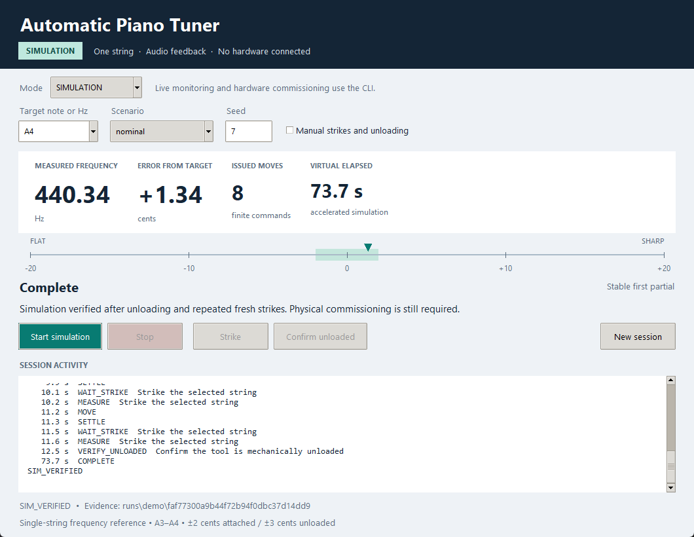
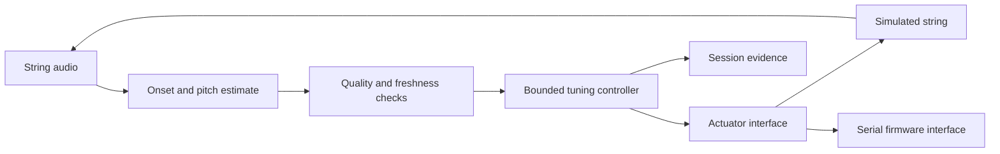

# Automatic Piano Tuner

**A software-only edition of my working automatic piano tuner project.**

This repository includes pitch detection, tuning control, an interactive simulator, and firmware protocol logic. It runs without physical components. This edition has been validated in simulation; hardware-specific integration and testing remain pending.

The project explores one complete tuning loop: listen to an isolated string, estimate its pitch, request a small correction, then listen again. An operator selects the string and target and confirms that the tuning tool has been unloaded before the final checks.



[Quick start](#quick-start) · [Architecture](docs/architecture.md) · [Validation](docs/validation.md) · [Hardware interface](docs/hardware.md)

[Watch the desktop demo](artifacts/ui/simulation-demo.gif) · [WAV analysis view](artifacts/ui/file-analysis.png)

## What is included

- **Audio pitch estimation:** onset detection, first-partial estimation, signal-quality checks, and three-frame stability analysis.
- **Bounded tuning control:** finite moves, direction and response checks, freshness checks, movement budgets, and explicit unloaded verification.
- **Interactive desktop simulator:** target selection, automatic or manual strikes, fault scenarios, a cents display, and session history.
- **WAV analysis:** inspect a recorded strike without commanding an actuator.
- **Live interfaces:** microphone capture and serial transport behind explicit operating modes and configuration gates.
- **Firmware core:** allocation-free C++, strict command parsing, duplicate suppression, heartbeat handling, native tests, and an output-disabled RP2040 build.
- **Reproducible evidence:** seeded audio/control corpora, regression tests, JSON schemas, benchmark reports, and Windows/Linux CI.

The implemented range is A3–A4 (220–440 Hz), with one isolated string per session. Full-keyboard traversal, automatic muting, stretch tuning, and temperament planning are outside this edition.

## Quick start

Use Python **3.12**. The default application needs no microphone, serial port, cloud account, or connected device. The desktop uses Tk, included with standard Windows Python; Linux may require `python3-tk`.

### Windows PowerShell

```powershell
git clone https://github.com/ryanhami-lab/Automatic-Piano-Tuner.git
cd Automatic-Piano-Tuner
python -m venv .venv
.venv/Scripts/python.exe -m pip install -r requirements/host.lock.txt
.venv/Scripts/python.exe -m pip install --no-build-isolation --no-deps -e .
.venv/Scripts/python.exe -m pianotuner gui
```

### Linux

```sh
git clone https://github.com/ryanhami-lab/Automatic-Piano-Tuner.git
cd Automatic-Piano-Tuner
python3.12 -m venv .venv
.venv/bin/python -m pip install -r requirements/host.lock.txt
.venv/bin/python -m pip install --no-build-isolation --no-deps -e .
.venv/bin/python -m pianotuner gui
```

After installation, `./launch.ps1` or `sh launch.sh` opens the GUI. Both launchers also accept CLI arguments.

Select a target and scenario, then **Start simulation**. Automatic mode supplies simulated strikes and unloading; manual mode lets you perform those steps with the **Strike** and **Confirm unloaded** buttons. **Stop** ends the session. Simulation time is virtual, including the accelerated 60-second stability check.

## Command-line examples

Use the virtual environment's Python, or activate it before these commands:

```sh
python -m pianotuner demo --note A4 --seed 7 --trace
python -m pianotuner demo --hz 330 --initial-cents -12
python -m pianotuner demo --scenario wrong_direction --seed 7
python -m pianotuner analyze tests/fixtures/synthetic-a4.wav --note A4
python -m pianotuner benchmark --suite all
python -m pianotuner defaults
```

Fault scenarios include `no_response`, `wrong_direction`, `stale_audio`, `disconnect`, `unload_shift`, `lost_ack`, `lost_done`, and `sudden_slip`. A missing ACK can be resolved by a definitive DONE without retrying the move; a missing DONE leaves completion unknown and faults.

| Mode | Input | Actuation |
| --- | --- | --- |
| `SIMULATION` | Seeded string audio and mechanics | Simulated plant |
| `FILE_ANALYSIS` | Selected WAV file | None |
| `LIVE_MONITOR` | Selected microphone | None |
| `HARDWARE` | Microphone and commissioned profile | Gated interface; physical backend integration required |

Optional live dependencies are in `requirements/live.lock.txt`. `monitor --device 0 --note A4` selects an explicit microphone after those dependencies are installed. Live-device behavior is not part of the recorded validation for this edition.

## How the tuning loop works



The same estimator and controller are used by the simulation and live runtime. The controller sees audio measurements; only an independent benchmark evaluator can read simulated ground truth.

Three stable frames from a fresh strike permit one decision. The controller requests a finite correction, waits for completion and settling, then requires a new strike. Attached convergence uses a ±2-cent band. Final verification requires confirmed disable, mechanical unloading, three distinct strikes within ±3 cents, and another strike at least 60 seconds after unloading.

Each session writes metadata, timestamped events, and a terminal summary under `runs/`. `SIM_VERIFIED` identifies a simulated result; `ANALYSIS_COMPLETE` identifies measurement only. Generated sessions and local device configuration are excluded from Git.

## Validation

| Check | Recorded result |
| --- | --- |
| Windows Python suite | 225 tests passed |
| Linux Python suite | 224 passed; one Tk test skipped in the headless VM |
| Synthetic pitch corpus | 1,040/1,040 accepted; median absolute error 0.00246 cents |
| Nominal closed-loop corpus | 100/100 verified; zero false successes under simulated ground truth |
| Native firmware | Three CTests and 44 shared Python/C++ traces passed |
| Parser differential corpus | 5,388 cases passed |
| RP2040 firmware | Output-disabled target cross-compiled on Windows and Linux |

These are software and synthetic-audio results, not measurements of acoustic microphone accuracy or physical tuning performance. The Windows desktop was also exercised directly. See [validation details and reports](docs/validation.md) for scope and reproduction commands.

```sh
python -m pytest -q
python -m ruff check src tests tools
python -m mypy src
python -m pianotuner benchmark --suite all
python -m build --no-isolation
```

[GitHub Actions](../../actions) runs host checks on Windows and Ubuntu and builds the native and disabled RP2040 firmware. On headless Linux, `xvfb-run -a python -m pytest -q` includes the Tk lifecycle test.

## Firmware and hardware integration

The portable firmware core implements the command/session contract and local motion limits. The shipped RP2040 target has **physical outputs disabled, zero motion caps, and no configured actuation GPIO**. Connecting hardware alone does not enable tuning.

The component-specific STEP/DIR/ENABLE backend, electrical interlock sampling, calibration, and physical commissioning belong to the integration stage. [Hardware commissioning](docs/hardware.md) describes the required measurements and checks. [Firmware build instructions](docs/firmware-build.md) cover the native harness and disabled image.

## Repository layout

```text
src/pianotuner/
  dsp/          Onset detection and pitch estimation
  control/      Deterministic tuning state machine
  simulation/   Audio, mechanics, clock, and firmware models
  adapters/     Audio and serial interfaces
  runtime/      Operating modes and session orchestration
  ui/           CLI and Tk desktop
  reporting/    Session logs and benchmarks
firmware/       Portable C++ core, native harness, RP2040 target
tests/          Regression, conformance, and audio fixtures
configs/        Simulation profile and disabled physical template
schemas/        Configuration, protocol, and evidence schemas
artifacts/      Curated software validation reports and demo
```

The vendored jsmn parser retains its original [license](firmware/vendor/LICENSE.jsmn).
